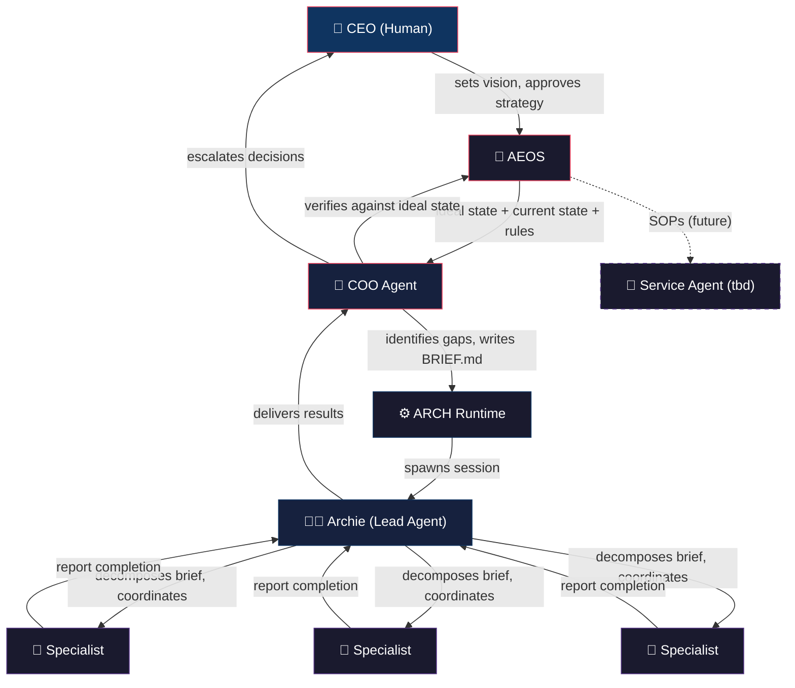

# AEOS — Agentic Enterprise Operating System

A living operating system for AI-driven businesses that continuously closes the gap between ideal state and current state.

## What It Is

AEOS is the business's constitution. It defines **what the business is trying to achieve** (ideal state), **where it is right now** (current state), and **how to close the gap** (the algorithm).

> "You can't hill-climb if you don't have a thing to hill-climb against." — Andrej Karpathy

## The Algorithm

```
1. DEFINE IDEAL STATE     — discrete, verifiable yes/no criteria
2. ASSESS CURRENT STATE   — honest snapshot, updated continuously
3. CONTINUOUS MIGRATION   — identify gaps, spawn initiatives, verify, repeat
```

## The Stack

| Layer | Lifespan | Role |
|-------|----------|------|
| CEO (Human) | Permanent | Sets vision, approves strategy |
| AEOS | Permanent | Business constitution — ideal state, current state, gap analysis |
| COO Agent | Persistent | Always-on operator running The Algorithm |
| Archie Sessions | Ephemeral | Scrum master for a specific initiative |
| Specialist Agents | Ephemeral | Execute specific tasks within an Archie session |
| Service Agents *tbd* | Persistent | Execute specific Services and SOPs indepentent of an Archie session |


## Documents

**[→ Read AEOS.md](https://github.com/levinebw/aeos/blob/main/AEOS.md)** — the full system specification: the algorithm, the stack, operating rules, escalation triggers, and open problems.

**[→ AEOS-TEMPLATE.md](https://github.com/levinebw/aeos/blob/main/AEOS-TEMPLATE.md)** — blank template to instantiate AEOS for your own enterprise.

## COO Agent

The generic COO Agent persona and core skills ship with the framework. Each AEOS instance inherits and extends them for its specific business.

**[→ COO Persona](personas/coo/COO.md)** — the COO's identity, constitutional principles, startup sequence, and weekly report format.

**Core Skills:**

| Skill | Description |
|-------|-------------|
| [assess-current-state](skills/assess-current-state/SKILL.md) | Evaluate the business against ideal state criteria |
| [identify-gaps](skills/identify-gaps/SKILL.md) | Prioritize the delta between ideal and current state |
| [write-brief](skills/write-brief/SKILL.md) | Create a scoped BRIEF.md for an Archie session |
| [weekly-status-report](skills/weekly-status-report/SKILL.md) | Produce the CEO's weekly status report |
| [budget-tracking](skills/budget-tracking/SKILL.md) | Maintain the financial ledger and flag budget risks |

Business-specific skills (marketing, fulfillment, product, etc.) are defined in each AEOS instance, not in the framework.

## Execution Engine

AEOS is the strategy. **[ARCH](https://github.com/levinebw/arch)** is the runtime that executes it — a multi-agent system that spawns Archie and specialist agents to close the gaps AEOS identifies.



---

## Intellectual Lineage

AEOS draws from a convergent body of thinking about agentic businesses, agent swarms, and ideal state management. Research compiled by [Claude](https://claude.ai) (Anthropic, March 2026).

### Daniel Miessler

The central influence. Miessler has been writing about AI-native business architecture since his 2016 book and is the originator of the ideal state management framework that AEOS is built on. His "Algorithm" — define ideal state, assess current state, continuously migrate — is AEOS's core loop. His PAI (Personal AI Infrastructure) project is the personal-scale implementation of the same ideas.

- [AI's Ultimate Use Case: State Management](https://danielmiessler.com/blog/ai-state-management)
- [Pursuing the Algorithm](https://danielmiessler.com/blog/the-last-algorithm)
- [Nobody is Talking About Generalized Hill-Climbing](https://danielmiessler.com/blog/nobody-is-talking-about-generalized-hill-climbing)
- [GitHub: Personal AI Infrastructure](https://github.com/danielmiessler/Personal_AI_Infrastructure)

### Andrej Karpathy

His framing of "verifiable software" is the philosophical foundation. His core insight — *"you can't hill-climb if you don't have a thing to hill-climb against"* — explains why ideal state criteria must be discrete and boolean. Also coined "agentic engineering" (Feb 2026).

### Sam Altman

The "one-person unicorn" thesis: the first billion-dollar solo-founder company is now possible because AI agents replace entire departments. This is the business case for AEOS from the top.

- [Sam Altman on the one-person unicorn (Fortune)](https://fortune.com/2024/02/04/sam-altman-one-person-unicorn-silicon-valley-founder-myth/)

### Ethan Mollick (Wharton)

The most prolific academic voice on agentic AI in practice. His blog *One Useful Thing* tracks how organizations adopting agentic AI gain advantage over those that don't. Argues we entered the true agentic era in late 2025 with tools like Claude Code and Codex.

- [One Useful Thing](https://www.oneusefulthing.org)

### Harrison Chase (LangChain)

Builder-side. His work on multi-agent orchestration is the technical realization of what AEOS describes at the strategic level. LangChain is the connective tissue of the agent ecosystem.

- [LangChain on building the orchestration layer (Sequoia)](https://sequoiacap.com/podcast/training-data-harrison-chase/)

### Institutional Research

McKinsey, MIT Sloan, and Deloitte have converged on an "agentic organization" framing that mirrors the AEOS stack: a graph of algorithms run by AI, with humans steering and improving rather than executing.

- [McKinsey: The Agentic Organization](https://www.mckinsey.com/capabilities/people-and-organizational-performance/our-insights/the-agentic-organization-contours-of-the-next-paradigm-for-the-ai-era)
- [MIT Sloan: The Emerging Agentic Enterprise](https://sloanreview.mit.edu/projects/the-emerging-agentic-enterprise-how-leaders-must-navigate-a-new-age-of-ai/)
- [Deloitte: The Agentic Reality Check](https://www.deloitte.com/us/en/insights/topics/technology-management/tech-trends/2026/agentic-ai-strategy.html)

### The Convergence

All of these thinkers land on the same structure AEOS formalizes:

| Layer | What They Call It |
|---|---|
| Vision / ideal state | OKRs → Ideal State Criteria (Miessler), PRD (engineering orgs) |
| Persistent operator | COO Agent, Chief of Staff AI, Orchestrator |
| Work execution | Agent swarms, multi-agent systems, specialist agents |
| Human role | Steering, improving, escalation handling |

The differentiator in Miessler's framing — and AEOS's — is the *continuous migration loop*. Most enterprise AI thinking is still additive ("sprinkle AI on departments"). AEOS treats the whole company as a single algorithm being hill-climbed against a defined ideal state.
